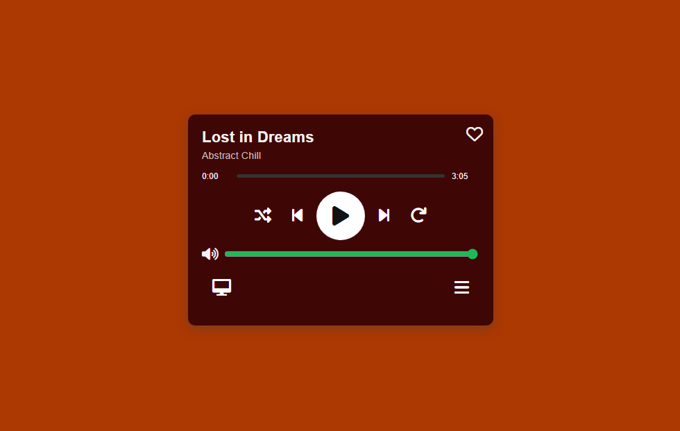

# 🎵 Modern Music Player

**Modern Music Player** is a sleek, responsive web-based audio player built with HTML, CSS, and JavaScript. Featuring an elegant user interface, smooth playback controls, playlist support, and responsive design, it delivers an enjoyable music listening experience across all devices.

Whether you're listening to your favorite songs, managing playlists, or simply exploring a modern media player interface, **Modern Music Player** provides a fast, intuitive, and visually appealing experience.

---

# ✨ Features

## 🎵 Audio Playback

Enjoy smooth music playback with intuitive controls for a seamless listening experience.

## 🎼 Playlist Management

Browse and manage your favorite songs through an organized playlist interface.

## 🔊 Volume Control

Adjust the playback volume instantly with an interactive volume slider.

## ⏱️ Progress Tracking

Track the current playback position with a dynamic progress bar and song duration display.

## 🎨 Modern UI/UX

Enjoy a beautiful music player featuring:

- Modern minimal design
- Smooth animations
- Responsive layout
- Elegant controls
- Interactive buttons
- Mobile-friendly interface

## ⚡ Fast Performance

Optimized JavaScript ensures smooth playback and responsive interactions across desktop and mobile browsers.

---

# 📸 Preview

<div align="center">
  <a href="https://mfs-portfoliouz.netlify.app/projects">
    
  </a>
  <p><i>Click to watch the demo on my portfolio</i></p>
</div>

*Click to listen using the live demo.*

---

# 🛠️ Built With

| Technology | Purpose |
|------------|----------|
| HTML5 | Structure & Semantic Layout |
| CSS3 | Styling, Responsive Design & Animations |
| JavaScript (ES6+) | Audio Controls & UI Interaction |

---

# 🚀 Getting Started

## Clone the Repository

```bash
git clone https://github.com/muxriddin-web/MusicPlayer
```

---

## Navigate into the Project

```bash
cd MusicPlayer
```

---

## Run the Project

Simply open:

```text
index.html
```

in your favorite browser.

No installation or server setup required.

---

# 🎧 Player Controls

| Action | Description |
|--------|-------------|
| ▶️ Play | Start music playback |
| ⏸️ Pause | Pause the current track |
| ⏮️ Previous | Play the previous song |
| ⏭️ Next | Play the next song |
| 🔀 Shuffle | Randomize song order |
| 🔁 Repeat | Repeat the current track |
| 🔊 Volume | Adjust playback volume |
| 📃 Playlist | Open the music playlist |

---

# 🎼 Music Features

The player includes:

- Audio playback
- Playlist support
- Progress bar
- Volume control
- Previous / Next navigation
- Shuffle mode
- Repeat mode
- Responsive interface

Future versions will introduce additional playback features and music management tools.

---

# 📱 Responsive Design

Fully optimized for:

- 💻 Desktop
- 💼 Laptop
- 📱 Mobile
- 📟 Tablet

---

# 🌟 Future Roadmap

- [ ] ❤️ Favorite Songs
- [ ] 🎼 Multiple Playlists
- [ ] 🔍 Music Search
- [ ] 🎵 Lyrics Support
- [ ] 🎧 Equalizer
- [ ] 🌙 Dark / Light Mode
- [ ] ☁️ Cloud Music Library
- [ ] 🎨 Custom Themes
- [ ] 🌍 Multi-language Support
- [ ] 📲 Background Playback

---

# 📂 Project Structure

```text
music-player/
│
├── index.html
├── style.css
├── script.js
│
├── assets/
│   ├── audio/
│   ├── images/
│   ├── icons/
│   └── fonts/
│
├── README.md
└── LICENSE
```

---

# 🤝 Contributing

Contributions are always welcome!

Fork the repository.

Create your feature branch.

```bash
git checkout -b feature/AmazingFeature
```

Commit your changes.

```bash
git commit -m "Add AmazingFeature"
```

Push to GitHub.

```bash
git push origin feature/AmazingFeature
```

Open a Pull Request.

---

# 📝 License

This project is distributed under the **MIT License**.

See the **LICENSE** file for more information.

---

# 📬 Contact

If you have questions, suggestions, or feedback, feel free to reach out.

### Project Repository

```text
https://github.com/muxriddin-web/MusicPlayer
```

### Author

**Muxriddin O'tkirov**

### GitHub

```text
https://github.com/muxriddin-web
```

---

# ⭐ Support

If you like this project, don't forget to give it a ⭐ on GitHub!

It helps the project grow and motivates future development.

---

# 💡 Quote

> **"Music speaks where words fail."**

---

## ❤️ Made with HTML, CSS & JavaScript
